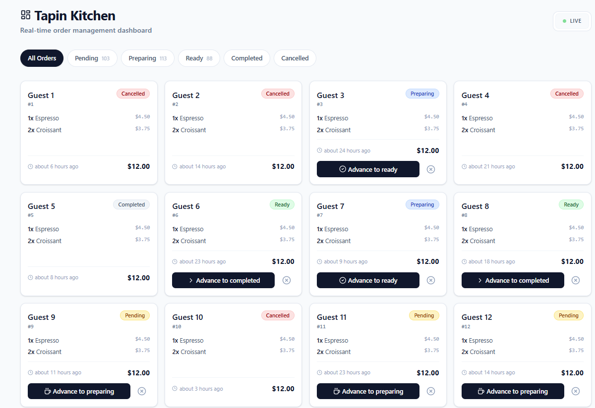

# Tapin Order Dashboard Technical Assessment

## Getting Started

To run this project locally:

1. Install dependencies: `npm install`
2. Start the development server: `npm run dev`
3. Build for production: `npm run build`

## Project Documentation

- [Original Task Description](./TASK_DESCRIPTION.md)
- [Future Decisions & Roadmap](./FUTURE_IMPROVEMENTS.md)

## Approach & Tech Choices

### 1. State Management with TanStack Query

I chose **TanStack Query (v5)** as the backbone for data fetching. For a kitchen dashboard, state synchronization is critical. React Query provides:

- **Automatic Caching**: Instant navigation between filters without re-fetching.
- **Optimistic Updates**: Crucial for a fast-paced environment. Kitchen staff clicks "Start", and the UI reacts immediately while the background sync happens.
- **Robust Rollback**: If a network hiccup occurs, the UI reverts to the last known valid state, preventing "ghost" orders from being worked on.

### 2. Performance: Virtualization (Option C)

With potentially 500+ orders, rendering them all as DOM nodes would lead to significant layout shifts and laggy scrolling. I implemented `react-window` to ensure:

- Only visible cards are rendered.
- 60FPS scrolling experience even on low-powered tablet devices commonly found in kitchens.
- Memory usage stays constant regardless of order volume.

### 3. Component Architecture

- **OrderDashboard**: The layout shell and orchestrator.
- **OrderFilter**: Decoupled filter component using a declarative status system.
- **OrderCard**: Container for individual order logic and micro-animations (using `motion`).
- **useOrders**: A headless custom hook that abstracts all API logic, optimistic updates, and derived stats.

### 4. Code Quality & UX

- **Type Safety**: Full TypeScript coverage with strict interfaces for Orders and Statuses.
- **Visual Polish**: Used the "Technical Dashboard" design recipe from the design system—minimal color, monospace fonts for data, and high-contrast interactive states.
- **Transitions**: Used `motion` for layout animations, ensuring that when an order is filtered or updated, it "moves" into its new position rather than teleporting.

## Tradeoffs due to Time Constraint

- **Mock Persistence**: The current mock API persists changes in-memory. In a real app, this would be an SQLite or Firestore integration.
- **Mobile responsiveness**: While the grid allows for 1-column layout on mobile, more touch-optimized gestures (like swiping to complete) would be added with more time.
- **Testing Coverage**: I provided unit tests for the core complex logic (`useOrders` hook), which is the most critical part to verify. Integrated E2E tests with Playwright would be next.
